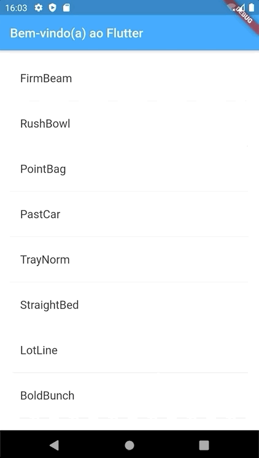

# Escreva seu primeiro aplicativo Flutter, parte 1

Este projeto contém o código fonte codelab [Write your first Flutter app, part 1](https://codelabs.developers.google.com/codelabs/first-flutter-app-pt1/#0) que foi traduzido por mim e disponibilizado em [Escreva seu primeiro aplicativo Flutter, parte 1](https://ivanwhm.gitbook.io/laboratorios-de-codigo-do-flutter/escreva-seu-primeiro-aplicativo-flutter-parte-1/introducao).

Todo o código foi adaptado para que você possa ter a melhor experiência em aprender Flutter sem a barreira do idioma Inglês.

Acompanhe todos os laboratórios de código Flutter traduzidos no endereço [https://ivanwhm.gitbook.io/laboratorios-de-codigo-do-flutter/](https://ivanwhm.gitbook.io/laboratorios-de-codigo-do-flutter/)

iOS | Android
----|--------
 | 

Feito com &hearts; por Ivan Wilhelm.

Codificado no [Visual Studio Code](https://code.visualstudio.com) da [Microsoft](https://www.microsoft.com.br)